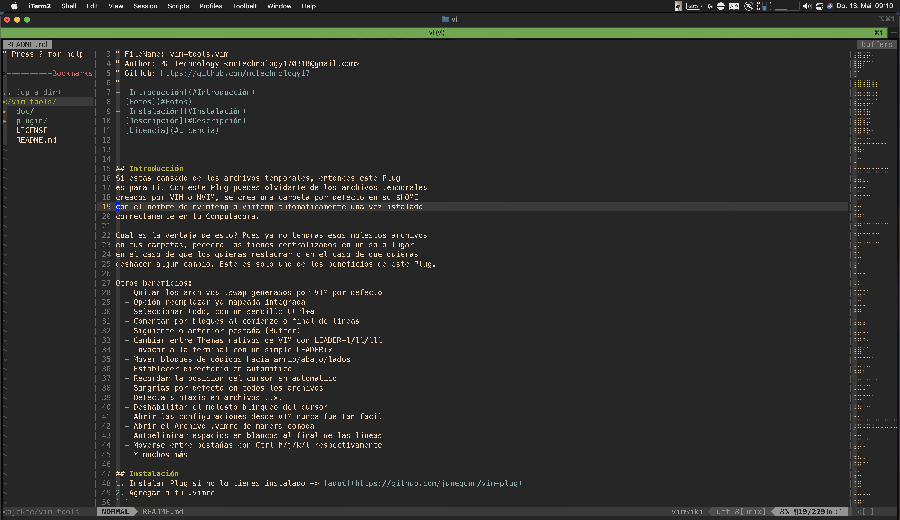

[](https://www.youtube.com/channel/UC_mYh5PYPHBJ5YYUj8AIkcw)
<div align="center">
  <br> <h1>⚙️  vim-tools 🛠 </h1>
</div>

<h4 align="center">
  <a href="" target="_blank"><code>Compatibilidad 👉 </code></a>
  <a href="https://www.vim.org/download.php" target="_blank"><code>Vim</code></a>
  <a href="https://github.com/macvim-dev/macvim" target="_blank"><code>MacVim</code></a>
  <a href="https://github.com/neovim/neovim" target="_blank"><code>NVim</code></a>
</h4>

<div align="right">
  <sub>Autor:
  <a href="https://twitter.com/mctechnology17">MC Technology</a>
</div>
<br>

- [Introducción](#Introducción)
- [Fotos](#Fotos)
- [Instalación](#Instalación)
- [Descripción](#Descripción)
- [Licencia](#Licencia)

----

## Introducción
Si estas cansado de los archivos temporales, entonces este Plug
es para ti. Con este Plug puedes olvidarte de los archivos temporales
creados por VIM o NVIM, se crea una carpeta por defecto en su $HOME
con el nombre de nvimtemp o vimtemp automaticamente una vez istalado
correctamente en tu Computadora.

Cual es la ventaja de esto? Pues ya no tendras esos molestos archivos
en tus carpetas, peeeero los tienes centralizados en un solo lugar
en el caso de que los quieras restaurar o en el caso de que quieras
deshacer algun cambio. Este es solo uno de los beneficios de este Plug.

Otros beneficios:
  - Quitar los archivos .swap generados por VIM por defecto
  - Opción reemplazar ya mapeada integrada
  - Seleccionar todo, con un sencillo Ctrl+a
  - Comentar por bloques al comienzo o final de lineas
  - Siguiente o anterior pestańa (Buffer)
  - Cambiar entre Themas nativos de VIM con LEADER+l/ll/lll
  - Invocar a la terminal con un simple LEADER+x
  - Mover bloques de códigos hacia arrib/abajo/lados
  - Establecer directorio en automatico
  - Recordar la posicion del cursor en automatico
  - Sangrías por defecto en todos los archivos
  - Detecta sintaxis en archivos .txt
  - Deshabilitar el molesto blinqueo del cursor
  - Abrir las configuraciones desde VIM nunca fue tan facil
  - Abrir el Archivo .vimrc de manera comoda
  - Autoeliminar espacios en blancos al final de las lineas
  - Moverse entre pestańas con Ctrl+h/j/k/l respectivamente
  - Y muchos más

## Instalación
1. Instalar Plug si no lo tienes instalado -> [aquí](https://github.com/junegunn/vim-plug)
2. Agregar a tu .vimrc
```vim
call plug#begin('~/.vim/plugged')
Plug 'mctechnology17/vim-tools'
call plug#end()
```
3. Actualizar fuentes e installar
```vim
:so %
:PlugInstall
```


## Descripción
" Función para problemas con archivos temporales,los archivos duplicados tambien se tomaron en cuenta.
```vim
set noswapfile
if !isdirectory($HOME."/vimtmp")
    call mkdir($HOME."/vimtmp", "p", 0770)
endif
set directory=~/vimtmp//,.  " intercambio
set backupdir=~/vimtmp//,.  " respaldo
set backup
if !isdirectory($HOME."/vimtmp/undo-dir")
    call mkdir($HOME."/vimtmp/undo-dir", "p", 0700)
endif
set undodir=~/vimtmp/undo-dir
set undofile
```

### Variables de entorno
```vim
let CONFIG_HOME = $PATH
let CONFIG_VIM = $PATH
let $CONFIG_HOME='$HOME/.config'
let $CONFIG_VIM='$HOME/.vimrc'
```

### Manera nativa, rapida y facil de reemplazar primeras xx->palabra a reemplazar y luego xx->palabra nueva
```vim
nmap <Leader>r :%s/xx/xx/gc
```

### Cansado de no poder seleccionar todo con Contro+a? Aquí lo tienes en VIM
```vim
nnoremap <C-A> ggVG
```

### Simbolos especiales reemplazados, para teclados ISO alemanes por ejemplo
```vim
" ß = final de linea
nnoremap ß $
vnoremap ß $
" ö = final de {}
nnoremap ö %
vnoremap ö %
" ü = comienzo d pagina
nnoremap ü gg
vnoremap ü gg
" ä = final de pagina
nnoremap ä G
vnoremap ä G
```

### Guardar y salir nunca fue tan facil
```vim
" guardar
nmap <Leader>w :w<CR>
" salir
nmap <Leader>q :q<CR>
```

### Comentar por bloques, solo reemplaza las xx
```vim
" desde hasta (al comienzo de la linea)
nmap <Leader>c :xx,xxs/^/#
" desde hasta (al final de la linea)
nmap <Leader>cc :xx,xxs/^#/
```

### Siguiente, anterior pestana o Buffer
```vim
nmap <Leader>b :bnext<CR>
nmap <Leader>bb :bprev<CR>
```

### Cambiar temas
```vim
nmap <Leader>l :colorscheme default<CR>
nmap <Leader>ll :colorscheme torte<CR>
nmap <Leader>lll :colorscheme slate<CR>
```

### Usa la terminal sin salirte de tu archivo
```vim
" set termwinsize=20x0
map <Leader>x :belowright terminal<CR>
nnoremap <Silent> <Leader>sh :terminal<CR>
```

### Mover bloques de codigo en Visual Mode
```vim
" De arriba hacia abajo y viceversa
vnoremap J :m '>+1<CR>gv=gv
vnoremap K :m '<-2<CR>gv=gv
" Mejor Indentación, de derecha a izquierda y viceversa
vnoremap < <gv
vnoremap > >gv
```

### Establecer directorio de trabajo en automático
```vim
autocmd BufEnter * lcd %:p:h
" cambiar directorio actual manual
nnoremap <leader>cd :lcd %:p:h<CR>
```

### Crea un nuevo archivo con un comando de edición con la ruta actual
```vim
noremap <Leader>nf :e <C-R>=expand("%:p:h") . "/" <CR>
```

### Abre un existente en una pestańa
```vim
noremap <Leader>op :tabe <C-R>=expand("%:p:h") . "/" <CR>
```

### Recordar posicion del cursor
```vim
autocmd BufReadPost *
     \ if line("'\"") > 0 && line("'\"") <= line("$") |
     \   exe "normal! g`\"" |
     \ endif
```

### Sangria automatica
```vim
augroup mysettings
  au FileType xslt,xml,css,html,xhtml,javascript,sh,config,c,cpp,docbook set smartindent shiftwidth=2 softtabstop=2 expandtab
  au FileType tex set wrap shiftwidth=2 softtabstop=2 expandtab
  " Confirm to PEP8
  au FileType python set tabstop=4 softtabstop=4 expandtab shiftwidth=4 cinwords=if,elif,else,for,while,try,except,finally,def,class
augroup END
```

### Sintaxis en archivos .txt
```vim
autocmd BufRead,BufNewFile *.txt set syntax=conf
```

### Deshabilitar el blinqueo del cursor
```vim
set gcr=a:blinkon0
```

### Bibliotecas y rutas
```vim
" ir a .config en una nueva pestańa
map <Leader>ü :vsp<Space>$CONFIG_HOME<CR>
" ir a .vimrc en una nueva pestańa
map <Leader>ä :vsp<Space>$CONFIG_VIM<CR>
```

### split de navegacion
```vim
" Saltar a ventana izquierda
map <C-h> <C-w>h
" Saltar a ventana abajo
map <C-j> <C-w>j
" Saltar a ventana arriba
map <C-k> <C-w>k
" Saltar a ventana derecha
map <C-l> <C-w>l
```

### Autoeliminar espacios al final de cada linea
```vim
autocmd BufWritePre * %s/\s\+$//e
autocmd BufWritePre * %s/\n\+\%$//e
autocmd BufWritePre *.[ch] %s/\%$/\r/e
```

## Fotos



## Licencia
[Licencia](./LICENSE)
