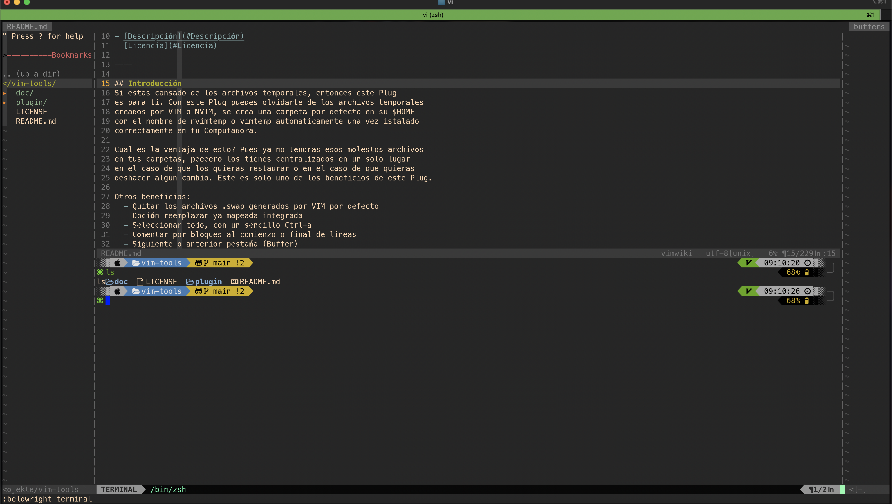

[](https://www.youtube.com/channel/UC_mYh5PYPHBJ5YYUj8AIkcw)
<div align="center">
  <br> <h1>⚙️  vimtools 🛠 </h1>
</div>

<h4 align="center">
  <a> Compatibility 👉 </a>
  <a href="https://www.vim.org/download.php" target="_blank"><code>Vim</code></a>
  <a href="https://github.com/macvim-dev/macvim" target="_blank"><code>MacVim</code></a>
  <a href="https://github.com/neovim/neovim" target="_blank"><code>NVim</code></a>
</h4>

<div align="right">
  <sub>Author:
  <a href="https://twitter.com/mctechnology17">MC Technology</a>
</div>
<br>

- [Intro](#Intro)
- [Fotos](#Fotos)
- [Installation](#Installation)
- [Description](#Description)
- [LICENSE](#LICENSE)

----

## Intro
If you are tired of temporary files,
of no auto predictor, of the small letters in GVim,
the annoying error in Vim that you did not save the changes correctly,
of not remembering how you do to replace or change words,
that the keys with "a" or "u on the German keyboard do not have extra functionality,
always write: w: q etc? then this Plug is for you.
With this Plug you can forget about temporary files
created for VIM, Vi, GVIm, MacVim and the all-powerful NVIM editor.

## Installation

### Using [Vundle](https://github.com/gmarik/vundle):

Just add this line to your `~/.vimrc`:

```vim
Plugin 'mctechnology17/vimtools'
```
And run `:PluginInstall` inside Vim.

### Using [pathogen.vim](https://github.com/tpope/vim-pathogen):

Copy and paste in your shell:

```bash
cd ~/.vim/bundle
git clone https://github.com/mctechnology17/vimtools
```

### Using [vpm](https://github.com/KevinSjoberg/vpm):

Run this command in your shell:

```bash
vpm insert mctechnology17/vimtools
```

### Using [Plug](https://github.com/junegunn/vim-plug):

Just add this line to your `~/.vimrc` inside plug call:

```vim
Plug 'mctechnology17/vimtools'
```

And run `:PlugInstall` inside Vim or `vim +PlugInstall +qa` from shell.


## Description
```vim
if !exists('g:vimtools_loaded')
    let g:vimtools_loaded = 0
endif

if g:vimtools_loaded == 0
    let CONFIG_NVIM = $PATH
    let CONFIG_VIM = $PATH
    if has('win32')&&!has('win64')
        if filereadable(expand('$HOME/_vimrc'))
            let $CONFIG_VIM='$HOME/_vimrc'
        endif
        if filereadable(expand('$HOME/AppData/Local/nvim/init.vim'))
            let $CONFIG_NVIM='$HOME/AppData/Local/nvim/init.vim'
        endif
        if has('nvim')
            map <F2> :vsp<Space>$CONFIG_NVIM<CR>
        else
            map <F2> :vsp<Space>$CONFIG_VIM<CR>
        endif
    else
        if filereadable(expand('$HOME/.vimrc'))
            let $CONFIG_VIM='$HOME/.vimrc'
        endif
        if filereadable(expand('$HOME/.config/nvim/init.vim'))
            let $CONFIG_NVIM='$HOME/.config/nvim/init.vim'
        endif
        if has('nvim')
            map <F2> :vsp<Space>$CONFIG_NVIM<CR>
        else
            map <F2> :vsp<Space>$CONFIG_VIM<CR>
        endif
    endif

    if isdirectory('/usr/share/dict/words')
        set dictionary+=/usr/share/dict/words
    endif

    if has('win32')&&!has('win64')
        set guifont=Consolas:h12
    endif

    if !isdirectory($HOME."/vimtools_tmp")
        call mkdir($HOME."/vimtools_tmp", "p", 0770)
        echomsg 'vimtools: $HOME/vimtools_tmp folder was created'
        sleep 2

        if !isdirectory($HOME."/vimtools_tmp/nvim_tmp")
            call mkdir($HOME."/vimtools_tmp/nvim_tmp", "p", 0770)
        endif
        if !isdirectory($HOME."/vimtools_tmp/nvim_tmp/undo_dir")
            call mkdir($HOME."/vimtools_tmp/nvim_tmp/undo_dir", "p", 0700)
        endif
        if !isdirectory($HOME."/vimtools_tmp/nvim_tmp/nvim_viewdir")
            call mkdir($HOME."/vimtools_tmp/nvim_tmp/nvim_viewdir", "p", 0770)
        endif
        echomsg 'vimtools: undo_dir, nvim_tmp and nvim_viewdir folders were created'
        sleep 2

        if !isdirectory($HOME."/vimtools_tmp/vim_tmp")
            call mkdir($HOME."/vimtools_tmp/vim_tmp", "p", 0770)
        endif
        if !isdirectory($HOME."/vimtools_tmp/vim_tmp/undo_dir")
            call mkdir($HOME."/vimtools_tmp/vim_tmp/undo_dir", "p", 0700)
        endif
        if !isdirectory($HOME."/vimtools_tmp/vim_tmp/vim_viewdir")
            call mkdir($HOME."/vimtools_tmp/vim_tmp/vim_viewdir", "p", 0770)
        endif
        echomsg 'vimtools: undo_dir, vim_tmp and vim_viewdir folders were created'
        sleep 2
    else
        if has('nvim')
            set viewdir=~/vimtools_tmp/nvim_tmp/nvim_viewdir
            set directory=~/vimtools_tmp/nvim_tmp//,.
            set backupdir=~/vimtools_tmp/nvim_tmp//,.
            set undodir=~/vimtools_tmp/nvim_tmp/undo_dir
            autocmd BufWinLeave *.* mkview
            autocmd BufWinEnter *.* silent! loadview
            autocmd BufWritePost !find $HOME/vimtools_tmp/nvim_tmp/undo_dir -type f -mtime +90 -delete
        else
            set viewdir=~/vimtools_tmp/vim_tmp/vim_viewdir
            set directory=~/vimtools_tmp/vim_tmp//,.
            set backupdir=~/vimtools_tmp/vim_tmp//,.
            set undodir=~/vimtools_tmp/vim_tmp/undo_dir
            autocmd BufWinLeave *.* mkview
            autocmd BufWinEnter *.* silent! loadview
            autocmd BufWritePost !find $HOME/vimtools_tmp/vim_tmp/undo_dir -type f -mtime +90 -delete
        endif
        set backup                  " set nobackup nowritebackup
        set undofile                " set noundofile
        set noswapfile              " set swapfile
    endif

    nnoremap <C-A> ggVG
    nnoremap ß $
    vnoremap ß $
    nnoremap ö %
    vnoremap ö %
    nnoremap ü gg
    vnoremap ü gg
    nnoremap ä G
    vnoremap ä G
    inoremap <TAB> <C-N>
    vnoremap J :m '>+1<CR>gv=gv
    vnoremap K :m '<-2<CR>gv=gv
    vnoremap < <gv
    vnoremap > >gv
    nnoremap + 3<C-w>>
    nnoremap - 3<C-w><

    augroup mysettings
      au FileType xslt,xml,css,html,xhtml,javascript,sh,config,c,cpp,docbook set smartindent shiftwidth=2 softtabstop=2 expandtab
      au FileType tex set wrap shiftwidth=2 softtabstop=2 expandtab
      au FileType python set tabstop=4 softtabstop=4 expandtab shiftwidth=4 cinwords=if,elif,else,for,while,try,except,finally,def,class
      au BufRead,BufNewFile *.txt set syntax=conf
      au BufWritePre * %s/\s\+$//e
      au BufWritePre * %s/\n\+\%$//e
      au BufWritePre *.[ch] %s/\%$/\r/e
      au BufReadPost *
            \ if line("'\"") > 0 && line("'\"") <= line("$") |
            \   exe "normal! g`\"" |
            \ endif
      au BufEnter * lcd %:p:h
    augroup END

    map <C-h> <C-w>h
    map <C-j> <C-w>j
    map <C-k> <C-w>k
    map <C-l> <C-w>l
    function MoveWithArrows()
      map <S-LEFT> <C-w>h
      map <S-DOWN> <C-w>j
      map <S-UP> <C-w>k
      map <S-RIGHT> <C-w>l
    endfunction

    if has('nvim') || has("gui_macvim")
          \ || has("gui_gtk2") || has("gui_gtk3")
          \ || has("gui_win32")
      call MoveWithArrows()
    endif

    if has('macunix')
      vmap <D-c> :!pbcopy<CR>
      nmap <D-c> :!pbcopy<CR>
      vmap <D-c> :w !pbcopy<CR><CR>
      vmap <D-c> :w !pbcopy<CR><CR>
      vmap <D-v> :!pbpaste<CR>
      nmap <D-v> :!pbpaste<CR>
      vmap <D-v> :w !pbpaste<CR><CR>
      vmap <D-v> :w !pbpaste<CR><CR>
    endif
endif
```

## Fotos



## [LICENSE](LICENSE)

Released under the GNU General Public License v3.0.

Copyright (c) 2021 MC Technology
